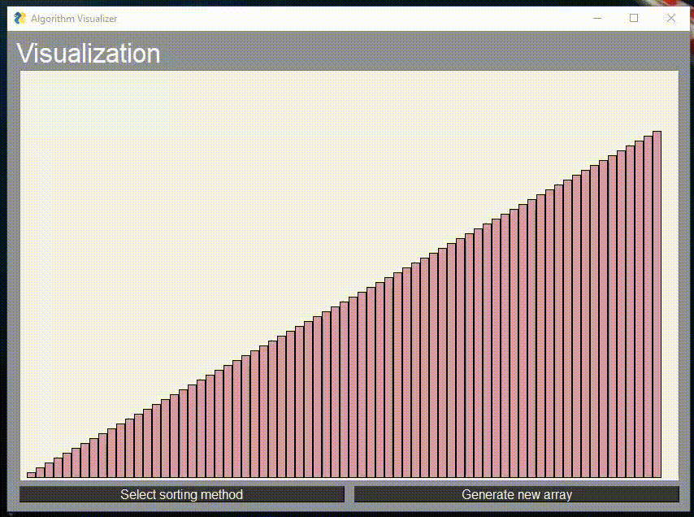

# Sorting visualizer
This program visualizes sorting algorithm by using pysimplegui.

## How to run
* Clone or download repo
* Setup virtual environment
* Activate it
* Install required modules from requirements.txt with ``` pip install -r /path/to/requirements.txt ```
* Run through cmd with ``` python visual.py ```



